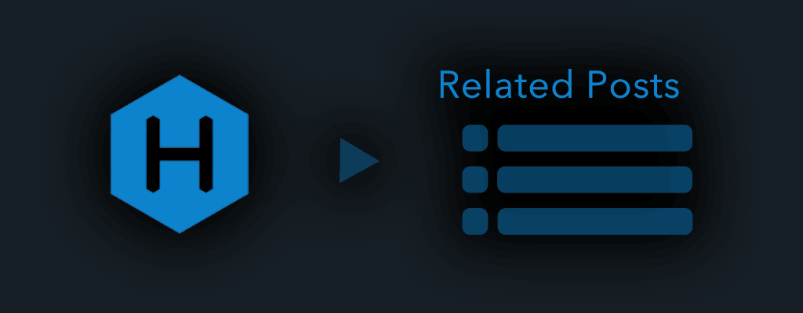

# hexo-related-popular-posts

A hexo plugin that generates a list of links to related posts or popular posts. Also , this plugin can display Visitor Counts (Pageview) on posts.



## DEMO & Documents

- DEMO : [My Posts](https://photo-tea.com/p/tea-plantation-mtfuji/) has generated [related posts](https://photo-tea.com/p/tea-plantation-mtfuji/#relatedPosts) and [popular posts](https://photo-tea.com/p/tea-plantation-mtfuji/#popularPosts) like this. 
- Documents : [read me](https://photo-tea.com/p/hexo-related-popular-posts/) (Japanese)

#### Thank you for introduction.

- *KOREA*：　[Plugins hexo-related-popular-posts 설정하기 - MSFL::모리스 소프트웨어 공작소, IT Blog](http://ccambo.gitlab.io/2017/04/19/Plugins-hexo-related-popular-posts-%EC%84%A4%EC%A0%95%ED%95%98%EA%B8%B0/)
- *JAPAN*：　[サイトをカスタマイズしました : タグクラウドプラグイン & 関連記事表示プラグインの導入 & 一部シェアボタン追加 - YoshinoriN's Memento](https://yoshinorin.net/2016/11/03/hexo-blog-customize/)
- *JAPAN*：　[HEXOをカスタマイズしました(関連記事プラグイン導入とか)">HEXOをカスタマイズしました(関連記事プラグイン導入とか) - 可愛いを叫ぶブログ](http://8hagi.sakura.ne.jp/sblog/2017/02/11/hexo-related-post/)
- *JAPAN*：　[Hexo に 関連する記事のリストを追加する - Azriton's blog](https://azriton.github.io/2017/06/16/Hexo%E3%81%AB%E9%96%A2%E9%80%A3%E3%81%99%E3%82%8B%E8%A8%98%E4%BA%8B%E3%81%AE%E3%83%AA%E3%82%B9%E3%83%88%E3%82%92%E8%BF%BD%E5%8A%A0%E3%81%99%E3%82%8B/)

## Overview

- Generate related list of posts. (Relevance of tags & Relevance of contents)
- Generate popular list of posts. (Sort posts by page views)
- Get Page Views information on posts. (Visitor Counter)

A hexo plugin that generates a list of links to related posts based on tags , and plugin that generates a list of links to popular posts base on page view of Google Analytics. Popular posts need Google Analytics API. 

Also , this plugin can generates a list of links to related posts based on contents. In addition , plugin supports different styles, thumbnails, is fully customizable and includes caching for improved performance.


## Installation

``` bash
$ npm install hexo-related-popular-posts --save
```

If you occur `ERROR Plugin load failed:` error or `DTraceProviderBindings.node` error , please see below.

- [ISSUE_TEMPLATE](https://github.com/tea3/hexo-related-popular-posts/blob/master/.github/ISSUE_TEMPLATE.md)
- [DTraceProviderBindings.node issue #1](https://github.com/tea3/hexo-related-popular-posts/issues/1)

## Usage

### 1. Edit your theme

First, add the following `popular_posts()` helper tag in template file for article. Please edit `themes/(your-theme)/layout/_partial/your_template.ejs`. For example , In [hexo-theme-landscape](https://github.com/hexojs/hexo-theme-landscape) you will edit `themes/landscape/layout/_partial/article.ejs`.

``` ejs
  <%-
    popular_posts()
  %>
```

Please refer follow as about how to use this plugin with based other templates.

- [Swig (e.g. hexo-theme-next)](https://github.com/tea3/hexo-related-popular-posts/issues/4)

### 2. Add tags in posts

If tags are included in the article, related articles will be displayed as a list. For example, add a tag like the following markdown file.

```
---
title: Hello World
tags:
  - program
  - diary
  - web
---
Welcome to [Hexo](https://hexo.io/)! This is a sample article. Let's add some tags as above.
...
```

The larger the number of matching tags, the more relevant articles are displayed as candidates.

### 3. Run server

Starts a local server. By default, this is at `http://localhost:4000/`.

``` bash
$ hexo clean
$ hexo server
```

The above is an easy introduction usage.

---

## More settings

If you want to make more detailed settings , please see below for the details.

- [Options of hepler](https://github.com/tea3/hexo-related-popular-posts#options-of-hepler)
- [Popular posts](https://github.com/tea3/hexo-related-popular-posts#popular-posts)
- [Advanced Related posts (Morphological Analysis)](https://github.com/tea3/hexo-related-popular-posts#advanced-related-posts-morphological-analysis)
- [Cache (Improve generation speed.) ](https://github.com/tea3/hexo-related-popular-posts#cache)
- [Log](https://github.com/tea3/hexo-related-popular-posts#log)
- [Customize HTML](https://github.com/tea3/hexo-related-popular-posts#customize-html)
- [Visitor Counter](https://github.com/tea3/hexo-related-popular-posts#visitor-counter)
- [Ranking Sheet](https://github.com/tea3/hexo-related-popular-posts#ranking-sheet)


Also , this plugin can set the following options. Please edit your config file `_config.yml`.

``` yaml
# More detailed settings
popularPosts:

  # (optional) Popular posts options
  googleAnalyticsAPI:
    clientId: ******.apps.googleusercontent.com
    serviceEmail: *****@developer.gserviceaccount.com
    key: /hexo-project-root/path/to/google-services.pem
    viewId: 12345678
    dateRange: 30
    expiresDate: 10
    pvMeasurementsStartDate: 2015/11/01
    rankingSheet: rankingSheet.txt
    # cache:            # (Deprecated) This options is Deprecated > v0.1.3
    #  path: hexo-related-popular-posts-ga-cached.json  # (Deprecated) This options is Deprecated > v0.1.3
    #  expiresDate: 10  # (Deprecated) This options is Deprecated > v0.1.3
    
  # (optional) Advanced Related posts options
  morphologicalAnalysis: 
    negativeKeywordsList: pluginSettings/hexo-rpp-negativewords.txt
    limit: 300
    
  # (optional) Related post's weight options
  weight:
    tagRelevancy: 1.0
    contentsRelevancy: 1.0
    
  # (optional) Cache options (Improve generation speed.)
  cache:
    path: cache/hexo-popular-related-posts-ga-cached.json
    
  # (optional) Log options
  log: true
```


## Options of hepler

`popular_posts()` helper can set the following options.

| option | description | default |
| :--- | :--- | :--- |
| maxCount| Maximum count of a list | `5` |
| ulClass| Class name of element | `'popular-posts'` |
| PPMixingRate| Mixing ratio of popular posts and related posts | `0.0`(=Related posts only) |
| isDate| visible the date | `false` |
| isImage| visible the image | `false` |
| isExcerpt| visible the excerpt | `false` |
| PPCategoryFilter | Option to fix category on Popular Posts | `undefined` |

### Helper's Option Examples

1. Related Articles will generate 5 posts. Also, Image of Articles generate .

``` ejs
  <%-
    popular_posts_json({ maxCount: 5 , ulClass: 'popular-posts' , PPMixingRate: 0.0 , isImage: true})
  %>
```

2. Popular Articles will generate 10 posts . (Popular posts need Google Analytics API.)

``` ejs
  <%-
    popular_posts_json({ maxCount: 10 , ulClass: 'popular-posts' , PPMixingRate: 1.0 })
  %>
```


If you want customize list's html , please use [Customize HTML](https://github.com/tea3/hexo-related-popular-posts#customize-html)

---

## Popular posts

Popular posts base on page view of Google Analytics. Popular posts need Google Analytics API. Please edit your config file `_config.yml` and set the following options. 

Please see [https://www.npmjs.com/package/ga-analytics](https://www.npmjs.com/package/ga-analytics) 

``` yaml
popularPosts:
  googleAnalyticsAPI:
    clientId: ******.apps.googleusercontent.com
    serviceEmail: *****@developer.gserviceaccount.com
    key: /hexo-project-root/path/to/google-services.pem
    viewId: 12345678
    dateRange: 30       # (Optional) The period you want to get by Google Analytics page view. Default = 30
    expiresDate: 10     # (optional) Expiration date of cache file. Default = 10
    # cache:            # (Deprecated) This options is Deprecated > v0.1.3
    #  path: hexo-related-popular-posts-ga-cached.json  # (Deprecated) This options is Deprecated > v0.1.3
    #  expiresDate: 10  # (Deprecated) This options is Deprecated > v0.1.3
```

If you want to use the environment variable. Please set the following. If you use Windows , please see [youtube](https://www.youtube.com/watch?v=C-U9SGaNbwY) about what how to set environment variable. 

``` bash
$ export GOOGLEAPI_CLIENTID="******.apps.googleusercontent.com"
$ export GOOGLEAPI_EMAIL="*****@developer.gserviceaccount.com"
$ export GOOGLEAPI_KEY="/path/to/google-services.pem"
$ export GOOGLEAPI_ANALYTICS_TABLE="ga:12345678"
```

``` yaml
popularPosts:
  googleAnalyticsAPI:
    # clientId: ******.apps.googleusercontent.com
    # serviceEmail: *****@developer.gserviceaccount.com
    # key: /hexo-project-root/path/to/google-services.pem
    # viewId: 12345678
    dateRange: 60
    expiresDate: 10
```

---

## Advanced Related posts (Morphological Analysis)

This plugin that can generates a list of links to related posts based on content's keywords and internal link. Support language is as follow. [Please cooperate with support of other languages.](https://github.com/tea3/hexo-related-popular-posts/pulls)

- ja
- en

If you want to generates a list of links to related posts based on contents , please set the `morphologicalAnalysis` option.

``` yaml
popularPosts:
  morphologicalAnalysis: 
```

More detailed options can be set as follows.


``` yaml
popularPosts:
  morphologicalAnalysis: 
    negativeKeywordsList: hexo-rpp-negativewords.txt  # (optional) If you want to exclude the keywords for analytics , set the exclude file.
    limit: 300              # (optional) If you want to limit the number of keywords for analytics , set the number.
  weight:                   # (optional)
    tagRelevancy: 1.0       # (optional) Weight of tag relevancy. Default = 1.0
    contentsRelevancy: 1.0  # (optional) Weight of contents relevancy. Default = 1.0
```

For example, `hexo-rpp-negativewords.txt`  can describe a regular expression as follows. Please enter the keywors of each data separated by newlines.

``` txt
^.$
^[0-9]+$
^String to exclude from related keywords$
^関連キーワードから除外しておきたい文字列を正規表現で指定する$
^要从相关关键字排除的字符串$
...
```

---

## Cache

This option improves the generation speed. please set the `cache` option.

``` yaml
popularPosts:
  cache:
    path: hexo-popular-related-posts-cached.json
```

---

## Log

When this option is enabled, logs are displayed. please set the `log` option.

``` yaml
popularPosts:
  log: true  # (Optional) When this option is enabled, logs are displayed. Default = true
```


---

## Customize HTML

If you want customize list's html , please use `popular_posts_json()` helper and `htmlGenerator()` register . 


First , please edit `themes/(your-theme)/layout/_partial/your_article_template.ejs` .

``` ejs
<%-
    htmlGenerator( 
        popular_posts_json({ maxCount: 5 , ulClass: 'popular-posts' , PPMixingRate: 0.0 , isDate: true , isImage: true , isExcerpt: true})
    )
%>
```

Second , please edit `themes/(your-theme)/scripts/your_scripts.js` .

``` javascript
// Examples of helper
hexo.extend.helper.register('htmlGenerator', function(args){
  if(!args || !args.json || args.json.length == 0)return "";
  
  var returnHTML = "";
  
  function generateHTML(list){
    
    var ret = "";
    ret += "<li class=\"" + args.class + "-item\">";
    
    if(list.date && list.date != ""){
        ret += '<div class="'+args.class+'-date">' + list.date + "</div>";
    }
    
    if(list.img && list.img != ""){
        ret += '<div class="'+args.class+'-img">' + '' + "</div>";
    }
    ret += '<div class="'+args.class+'-title"><h3><a href="' + list.path + '" title="'+ list.title +'" rel="bookmark">'+ list.title + "</a></h3></div>";
    if(list.excerpt &&  list.excerpt != ""){
        ret += '<div class="'+args.class+'-excerpt"><p>' + list.excerpt + "</p></div>";
    }
    
    ret +=  "</li>";
    return ret;
  }
  
  for(var i=0; i<args.json.length; i++){
      returnHTML += generateHTML(args.json[i]);
  }
  
  if(returnHTML != "")returnHTML = "<ul class=\"" + args.class + "\">" + returnHTML + "</ul>";
  
  return returnHTML;
});
```

---

## Visitor Counter

This plugin can get Page Views information on posts. please set the `pvMeasurementsStartDate` option. Also , Visitor Counter need [Google Analytics API](https://github.com/tea3/hexo-related-popular-posts#popular-posts) .

First , please edit your config file `_config.yml`.

``` yaml
popularPosts:
  # (optional) Popular posts options
  googleAnalyticsAPI:
    clientId: ******.apps.googleusercontent.com
    serviceEmail: *****@developer.gserviceaccount.com
    key: /hexo-project-root/path/to/google-services.pem
    viewId: 12345678
    dateRange: 30
    expiresDate: 10
    pvMeasurementsStartDate: 2015/11/01
```

Second , add the following `popular_posts_pv()` helper tag in template file for article. please edit `themes/(your-theme)/layout/_partial/your_article_template.ejs` . 

``` ejs
    This post's Visitor Counts is 
    <%- popular_posts_pv() %> 
    views.
```

---

## Ranking Sheet

This plugin can make Page Views Ranking Sheet. If you want to use , please set the `rankingSheet` option. Ranking Sheet need [Google Analytics API](https://github.com/tea3/hexo-related-popular-posts#popular-posts) .

``` yaml
popularPosts:
  # (optional) Popular posts options
  googleAnalyticsAPI:
    clientId: ******.apps.googleusercontent.com
    serviceEmail: *****@developer.gserviceaccount.com
    key: /hexo-project-root/path/to/google-services.pem
    viewId: 12345678
    dateRange: 30
    expiresDate: 10
    pvMeasurementsStartDate: 2015/11/01
    rankingSheet: rankingSheet.txt
```


---

## License

MIT

## Thank you for a wonderful plugin.

- Hexo : [http://hexo.io/](http://hexo.io/)
- ga-analytics : [https://github.com/sfarthin/ga-analytics](https://github.com/sfarthin/ga-analytics)
- kuromoji.js : [https://github.com/takuyaa/kuromoji.js](https://github.com/takuyaa/kuromoji.js)
